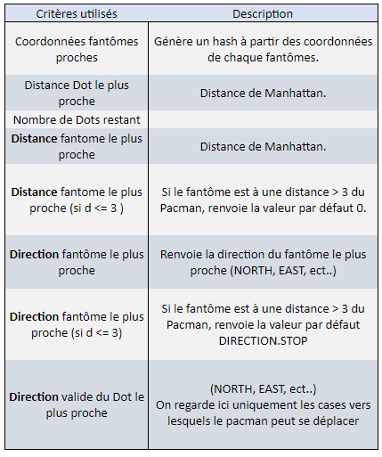
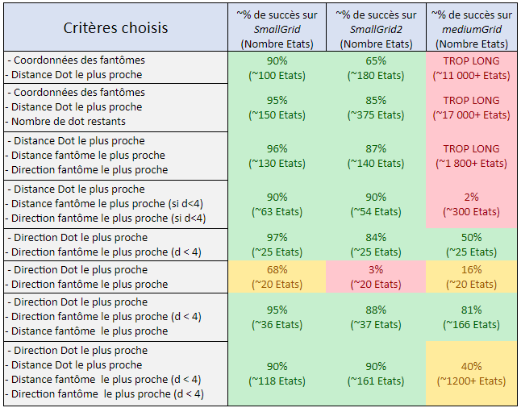
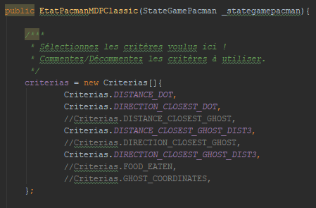
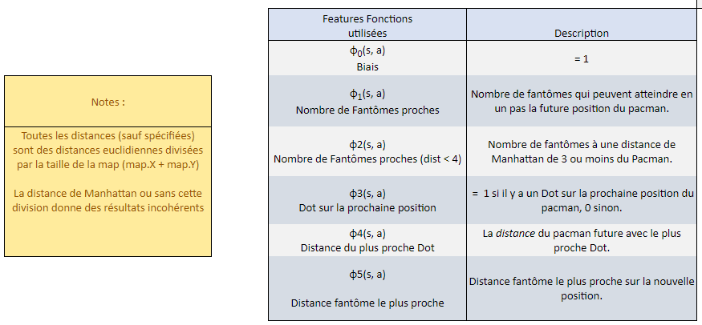
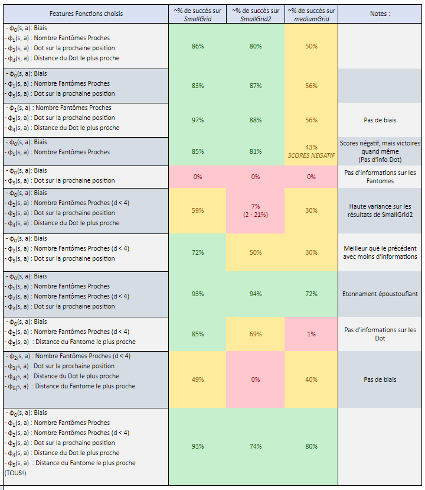
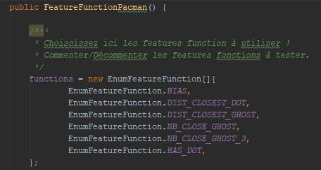

**Etudiant 1 : ENSUQUE Elie**

# Rapport TP1

## Question 5.1 Brigde Grid
*Donnez les valeurs des paramètres et la justification de ces choix*

Le bon paramètre est un bruit égal à 0.

Les états absorbants négatifs au bord du pont ont une récompense de -100, et vont extrêmement 
vite impacter les valeurs de Vk(s) si il y a du bruit, même avec un gamma très faible, et ainsi "dissuader"
complètement la politique de franchir le pont.
En passant de déplacements stochastique à déterministe, on élimine le risque de tomber dans un
état absorbant très négatif, et l'agent peut franchir le pont sans soucis pour atteindre la récompense +10.

## Question 5.2 Discount Grid
*Donnez les valeurs des paramètres dans chaque cas et la justification de ces choix*

1. Chemin sûr pour l'état absorbant +1 : **Récompense = -2**

Avec une récompense négative à chaque pas, on pousse l'agent à choisir une politique qui va lui faire le
moins de pas possible et atteindre le plus rapidement un état absorbant positif. Il va donc prendre le chemin risqué,
et s'arrêter à l'état absorbantt le plus près, +1, car rejoindre -10 engendrait trop de "pertes".

2. Chemin risqué pour l'état absorbant +10 : **bruit = 0.0**

En passant à un environnement déterministe, on élimine le risque de tomber dans le "fossé"
et la politique va simplement guider l'agent sur le chemin le plus court pour aller à la plus
haute récompense, soit le chemin risqué sur l'état absorbant +10.

3. Chemin sûr pour l'état absorbant +1 : **gamma = 0.3**

Un gamma faible réduit plus rapidement l'influence d'une récompense sur Vk(s) à chaque pas s'éloignant
de son état absorbant. Avec un gamma suffisamment faible, la récompense +10 est suffisamment
atténué pour que la politique favorise l'état absorbant +1 lorsque l'agent va passer à côté.
L'agent continue de prendre le chemin sûr, car à cause du bruit de 0.2 et la falaise, il va continuer à
éviter le chemin risqué. 

4. Eviter états absorbants : **Récompense +5.**

Avec une récompense élevée à chaque pas, il sera plus rentable pour l'agent de tourner en rond et accumuler des points,
que d'atteindre un des états absorbants. 

# Rapport TP2

## Question 1:
*Précisez et justifiez les éléments que vous avez utilisés pour la définition d’un état du MDP pour le jeu du Pacman (partie 2.2)*

Ce problème revient à trouver quels critères vont être utilisé pour différencier les états afin d'avoir un temps de calcul raisonnable,
tout en gardant des résultats cohérents.
Pour chaque tuple de valeurs possibles parmi les critères choisis, il existera un état différent.
On cherche donc un petit nombre de critère pour éviter la profilération d'état,
mais qui ont du sens pour la résolution du problème. On peut le voir comme en répondant à cette question :

"*Qu'elle est le strict minimum d'informations que j'ai besoin de connaître pour gagner une partie?*"

Pour éviter de multiplier les états, tout les critères ont des valeurs entières, de plus, tout les calculs de distance de cette partie 
sont des distances de Manhattan, pour la même raison.

Voici les différents critères avec lesquels j'ai expérimenté :

- **La position (x,y) des fantômes** : Des informations sur les fantômes sont impératives, car ils provoque une défaite et 
ont un comportement aléatoire, qui ne peut pas être implicitement représenté dans la politique. 

- **La distance de Manhattan avec les fantômes** : Une tentative de simplification du critère précédent. Un couple de coordonnées peut prendre de
très nombreuses valeurs différentes, mais beaucoup d'entre elles ont une signification similaire. On cherche ici à condenser l'information et
réduire le nombre d'états générés par les informations des fantômes. Voici des variantes plus précises qui ont été utilisés :
    - **La distance de Manhattan avec le fantôme le plus proche**
    - **La distance de Manhattan avec les fantômes à une distance de Manhattan de moins de 3** : 
    On ignore les fantômes qui sont trop loin pour être considérés une menace, et on utilise la valeur par défaut 0 dans ce cas.
On utilise une distance de manhattan au lieu d'une distance euclidienne pour garder des résultats entiers, des réels démultiplierait le nombre d'états.

- **La direction vers laquelle se trouve le fantôme le plus proche par rapport au Pacman** : En calculant l'angle entre Pacman et les fantômes, il est possible
d'obtenir une direction général de vers laquelle ils se trouve, NORTH, SOUTH, EAST, WEST. C'est un critère utilisé pour donner plus de sens aux calculs de distance,
afin de différencier un fantôme à une distance de 3 au Nord et un fantôme à une distance de 3 au Sud.
    - **Variante : La direction du fantôme le plus proche à une distance de Manhanttan de 3 ou moins** : On ignore les fantômes trop lointain pour être une menace, on renvoie une valeur par
    défaut si le fantôme est trop loin.

- **La distance du Dot le plus proche** : Le but étant de collecter des points, il est important d'avoir des informations permettant de savoir où les trouver.

- **La direction du Dot le plus proche** : La direction (EAST, WEST, ect...) du point le plus proche à collecter. Utile pour aider à diriger le pacman vers les récompenses.

- **Le nombre de Dot restants** : Derrière ce choix ce cache l'espoir qu'au fur et à mesure de l'entraînement, le Pacman
va développer un ordre de ramassage favori des Dot, et ainsi repérer où il en est et vers où se diriger en fonction du nombre de Dot restant ou mangés. 
C'était un critère surtout utile avant que je réussisse à calculer la direction du dot le plus proche.

Voici un tableau de résumé des critères utilisés :

Je n'ai pas utilisé la position du Pacman comme critère ou d'informations lié à la position du Pacman. Je suis parti du principe que les informations
sur les points à collecter et les fantômes à éviter sont les seuls critères vitaux à la réussite de l'agent : Il n'a pas besoin de savoir où il est,
mais de vers où il doit aller et vers où il ne doit pas aller.

Dans ma quête d'optimisation des résultats et de dépasser les 10% de réussite pour la grille de taille moyenne,
voici un tableau résumant les résultats que j'ai obtenus avec différentes combinaisons de critères, où j'inscris le pourcentage de succès moyen
du pacman après entraînement, et le nombre d'états moyen générées. (Mon code générant les états au fur et à mesure de leur 
utilisation, il arrive d'avoir moins d'états que la maximum théorique).

Voici une table de résultats obtenus avec différents critères :

Des notes et observations sur ses résultats :

**Sur les quatres premières lignes** se trouvent mes essais pour diminuer le nombre d'états et arriver à un temps de calcul viable sur MediumGrid. 
J'aurais réussi à baisser le nombre d'états à environ 300, mais en gardant des résultats médiocre sur mediumGrid. 
La faute étant que je n'avais pas encore réussi à calculer la direction du prochain Dot à ce moment-là, 
et qu'il manquait des informations sur les dots restants à récupérer. Mon agent devenait un dieu de l'esquive et arrivait
à éviter les fantômes très longtemps, sans jamais vraiment trouver comment ramasser le prochain dot.

Ensuite, la révélation, j'arrive à calculer la direction du prochain dot ! Le critère le plus fiable pour aider le pacman à ramasser tout les points 
et gagner. **Les quatres lignes restantes l'utilisent toute.**

Sur la cinquième ligne, j'obtiens de très bons résultats avec juste 25 états max (pour toute taille de grille!) en utilisant seulement
la direction du prochain dot et du fantôme le plus proche et pas trop loin, pour donner du sens à la menace. L'agent atteint 50% de réussite sur MediumGrid !

Sixième ligne, identique mais je prends la direction du fantôme le plus proche quel que soit la distance, les résultats sont bien plus bancales car en toujours
la direction d'un fantôme, l'agent ne sais pas à quel point celui-ci le menace vraiment.

**Les meilleurs résultats sont sur l'avant-dernière ligne**, avec la combinaison de direction du fantome proche et de distance du fantome. Les 81% sont atteints sur mediumGrid !

Petit cas étrange sur la dernière ligne, où l'ajout d'information rend les résultats moins bon ! Le nombre supplémentaire d'états rend peut-être l'entraînement trop difficile ?

**En conclusion**, pour entraîner correctement un agent, il est impératif d'avoir des critères permettant de correctement représenter les récompenses, positives et négatives.
Dans notre cas du Pacman, les points à collecter et fantômes à esquiver.
De plus on trouve les limites de l'apprentissage tabulaire avec la durée des calculs : Trop de critères impliquent trop d'états, qui impliquent un temps de calcul très long.
Sur certains problèmes complexes, il n'est pas possible de les représenter assez abstraitement pour n'avoir trop d'états.

**Notes :** Vous pouvez facilement tester différentes combinaisons en modifiant le constructeur de EtatPacmanMDPClassic,
en commentant/décommentant les critères voulus dans la déclaration du tableau ci-dessous. N'oubliez pas de modifier les autres paramètres
de départ dans testRLPacman.

## Question 2:
*Précisez et justifiez les fonctions caractéristiques que vous avez choisies pour la classe FeatureFunctionPacman (partie 2.3).*

Les Fonctions Caractéristiques sont différentes des critères tabulaires utilisés auparavant sur plusieurs aspects :
- Elles ne sont pas limités à des résultats entiers, il est même presque préférable d'utiliser des réels. 
- La fonction doit permettre de choisir la meilleur action parmis celle possibles à partir d'un même état, il faut donc
prendre en compte l'action choisie (ou la position future du pacman après celle-ci) dans le calcul.
- La fonction doit avoir une interprétation linéaire simple, c'est-à-dire : Plus la valeur est grande, mieux c'est,
ou plus la valeur est petite, mieux c'est. On va additioner les résultats pour savoir quelle action est la meilleure, 
il ne faut donc pas qu'un résultat de 3 soit à la fois plus important qu'un 1 et un 5. C'est pour ça qu'on ne peut pas prendre 
une direction comme résultat, comme dans la partie précédente. Les poids peuvent ajuster le signe du résultat. 

De plus, sauf contre-indication, les distances seront toutes des **distances euclidiennes** (au contraire de la partie précédente), divisées par la 
 taille de la carte (map.X + map.Y). Les résultats que j'ai eu avec une distance de Manhattan était assez médiocre, et si je ne 
 divise pas les résultats par la taille de la carte j'ai des résultats chaotiques où les valeurs des poids atteignent un StackOverflow du type Double.
 Même si je n'ai pas bien compris pourquoi.
 
Comme précédemment, le plus important est d'avoir des critères permettant d'avoir des informations sur les points à collecter
et les fantômes à esquiver. Généralement, les fonctions sur les points se verront associées des poids positifs, tandis que 
les fonctions sur les fantômes des poids négatifs.

 Voici donc un descriptif des fonctions caractéristiques utilisées :
 

Plusieurs des fonctions sont celles proposés dans le sujet du TP, mais voici quand même un explicatif pour chaque choix :

- **Le Biais** : Une valeur fixe quasi toujours présente, permet à l'algorithme de se créer une constante pour ajuster 
ses résultats, mais j'ai quand même pu avoir des résultats intéressants sans l'utiliser. (*Fonction du Sujet*)

- **Nombre de fantômes proches** : Permet de savoir si la case cible est dangereuse et présente 
    un risque immédiat de se faire manger par un fantôme. (*Fonction du Sujet*)
    
- **Nombre de fantômes proches (d < 4)** : Une version plus élargie du critère précédent, où on compte tout les fantômes
à une distance de manhattan de 3 ou moins. Permet de savoir si il y a des
fantômes *pas trop loin* du pacman. Le résultat est moins immédiatement interprétable que le précédent, mais étonnament,
j'ai eu mes meilleurs résultats quand il était utilisé de pair avec la fonction précédente.

- **Distance du fantôme le plus proche de la prochaine position** : Permet de mieux jauger le danger d'un fantôme.

- **Distance du Dot le plus proche de la prochaine position** : Permet de mieux orienter le pacman en jaugeant quelle direction
nous rapproche le plus d'une récompense. (*Fonction du Sujet*)

- **Présence d'un Dot sur la prochaine position** : Permet de savoir si il y a une récompense immédiate à saisir sur la prochaine case!
Peut-être plus impactant que la distance, car on peut plus facilement y mettre un gros poids afin d'avoir une valeur imposante dans le calcul (*Fonction du Sujet*)

Voici maintenant un tableau des résultats obtenus sur les différentes grilles avec de nombreuses combinaisons de critères différents :

Toute de suite, on remarque des résultats bien meilleurs en général sur MediumGrid, le temps de calcul est aussi bien plus court, car
il ne dépend plus d'un nombre d'états très élevés, on cherche juste quelles fonctions doivent avoir le plus d'impact sur nos choix. Le
temps de calcul étant principalement composé du temps de calcul de ces fonctions.

**Les 5 premières lignes** utilisent uniquement les fonctions caractéristiques données dans le sujet. 
On remarquera que plutôt étrangement, les résultats étaient légèrement meilleur sans le biais. 

Un autre cas particulier, lorsqu'on utilise juste le Biais et le nombre de fantôme, sans informations sur les dot, l'agent
arrive quand même à résoudre les niveaux. Toutefois on remarque que quasi tout ses scores sur mediumGrid sont négatifs ! L'agent 
arrive à gagner, mais tellement tardivement que ses points restent négatifs ! Il doit passer son temps à esquiver et finir éventuellement
par atteindre tout les points.

Expérience inverse sur la 5ème ligne, avec juste des informations sur les Dot et pas les fantômes : Cette fois-ci l'agent n'arrive à rien.
En y repensant il aurait probablement pu avoir des résultats un poil meilleur si la distance des dot étaient prises en compte, pour
avoir une idée de vers où aller.

La 6ème ligne est assez étrange, on prends les informations sur les points et les fantômes pas trop loin, et l'agent n'arrive 
à rien sur smallGrid2 ! Ayant même des meilleurs résultats sur mediumGrid. De plus, j'ai observé une grande variance des résultats sur
smallGrid2, j'ai réussi aussi bien à avoir 2% de réussite que 21% sur des moyennes de 3 essais.

Sur la 7ème ligne, en prenant la même chose que précédemment et retirant la distance, les résultats sont bien meilleures ! Un nouveau cas étonnant,
où la perte d'informations entraîne des résultats plus précis.

Sur la 8ème ligne, on peut voir que la combinaison du nombre de fantôme très proche et proche (dist < 4) donne des résultats époustouflant
et inattendus, avec 72% de réussite sur mediumGrid !

J'ai fait une nouvelle tentative de combinaison sans informations sur les points, avec la distance du fantôme proche et le nombre 
de fantôme proche (d < 4), mais les résultats sont encore plus catastrophique que précédemment, avec pourtant des critères qui semblerait
plus précis.

Sur l'avant-dernière ligne, une autre tentative n'utilisant pas le biais, avec beaucoup d'information sur les fantômes et les Dot,
mais les résultats sont ici très faible et mauvais même sur smallGrid et smallGrid2.

Enfin viens un essai où j'ai essayé toutes les fonctions en même temps, qui a donné d'excellents résultats, avec 80% de réussite sur mediumGrid !

En conclusion, ce que j'ai retenu de mes tests :
- Il faut impérativement avoir des informations sur les fantômes ET les points à collecter pour avoir de meilleurs résultats.
- Plus de fonctions n'est toujours pas mieux, parfois moins de fonctions caractéristiques fonctionne mieux. Serait-il possible
que plus d'entraînement ai été nécessaire ? Pourtant le dernier essai a bien réussi avec la même durée d'entraînement et 
plus de fonctions.
- Les fonctions caractéristiques 'radicales' semblent plus efficaces : J'appelle radicale les fonctions avec des 
informations sur une récompense immédiate, le nombre de fantôme à un pas de 1 ou la présence
d'un dot sur la prochaine case représente un gain ou perte de récompense immédiate sur la prochaine case, 
alors que les fonctions plus progressive, tel que la distance ou le nombre de fantôme lointain, est moins directement 
interprétable, et semble avoir une moins bonne performance, sans être inutile. 

Maintenant, entre l'approche **Tabulaire** et l'approche **d'Approximation Linéaire**, cette dernière me semble mieux.
Il est possible d'avoir de très bons résultats avec l'approche tabulaire, mais souvent au prix de plus d'efforts et d'un temps
de calcul bien plus elévé, et il est plus simple d'atteindre des résultats équivalents, si ce n'est mieux, avec l'approche linéaire.

Enfin, vous pouvez tester vous-même mon programme et différentes combinaisons en éditant ce tableau dans la classe FeatureFunctionPacman,
en commentant/décommentant les fonctions caractéristiques voulues avant de lancer le programme.

